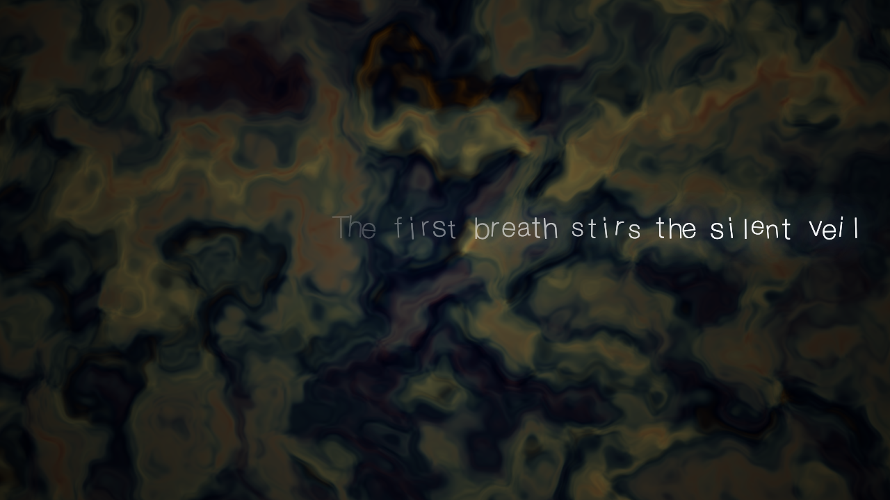

# OAV — Obscure Audio Visual

A living, breathing audiovisual portal in the browser. Not a visualizer. Not a demo. A presence.



## What Is This?

You open a page. Dark. A glow emerges. Rings of light expand.

You move your mouse — colors shift. You click — a pulse ripples through the void. After a few seconds, a word appears — not in a font, but in light. It drifts upward and dissolves.

You type into the void. Your letters scatter like startled birds. The world *hears* you. The bass deepens. The palette warms. Something ancient responds — not with answers, but with poetry.

**OAV** is a real-time, shader-driven experience where two LLMs collaborate to create a living world: one sculpts the visual engine through tool calls, the other whispers poetry into the void. The experience never ends — scenes flow organically, the world breathes, and silence is as meaningful as speech.

### Features

- **WebGL 2 shaders** — 4 organic scenes (intro, build, climax, outro) with domain-warped noise, fractal kaleidoscopes, and cosine palettes
- **30+ visual parameters** — color, geometry, pattern, motion, and post-processing uniforms, all LLM-controllable
- **4-layer audio drone** — sub bass, harmonics, filtered noise, ethereal pad with convolver reverb, scene-reactive mixing
- **Dual-LLM architecture** — Director (engine control via tool-calling) + Poet (poetic text generation)
- **Magnitude-driven responses** — subtle changes produce silence; dramatic shifts produce titles
- **21 named visual presets** — noir, vaporwave, psychedelic, cosmic, dream, nightmare, and more
- **Artful text input** — type into the void, characters scatter as particles
- **Infinite portal** — scenes cycle fluidly in random order, never repeating, never ending

## Quick Start

```sh
npm install
npm run dev          # → http://localhost:5173
```

Click anywhere to start audio. Type words into the void. Move your mouse. Press F2 for the debug overlay.

### LLM Integration (Optional)

Without an API key, OAV runs with curated ambient poetry. With one, two LLMs collaborate in real-time:

```sh
cp .env.example .env
# Add your NVIDIA NIM API key to .env
```

See [DEVELOPERS.md](DEVELOPERS.md) for full setup, architecture, and testing details.

## Documentation

- [DEVELOPERS.md](DEVELOPERS.md) — Technical setup, architecture, and contributing
- [docs/MANIFESTO.md](docs/MANIFESTO.md) — Creative vision
- [docs/Browser_Trackmo_ARCH.md](docs/Browser_Trackmo_ARCH.md) — Architecture overview
- [docs/adr/](docs/adr/) — Architecture Decision Records (ADR-001 through ADR-008)

## License

MIT
