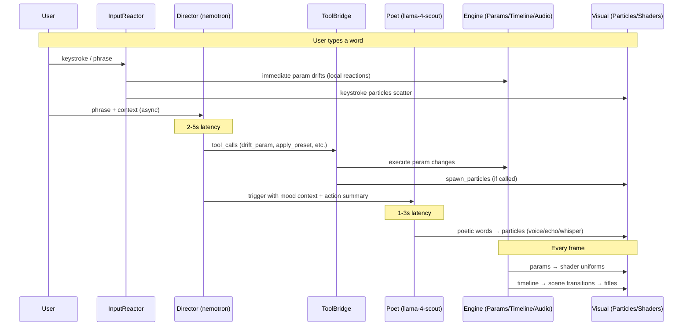
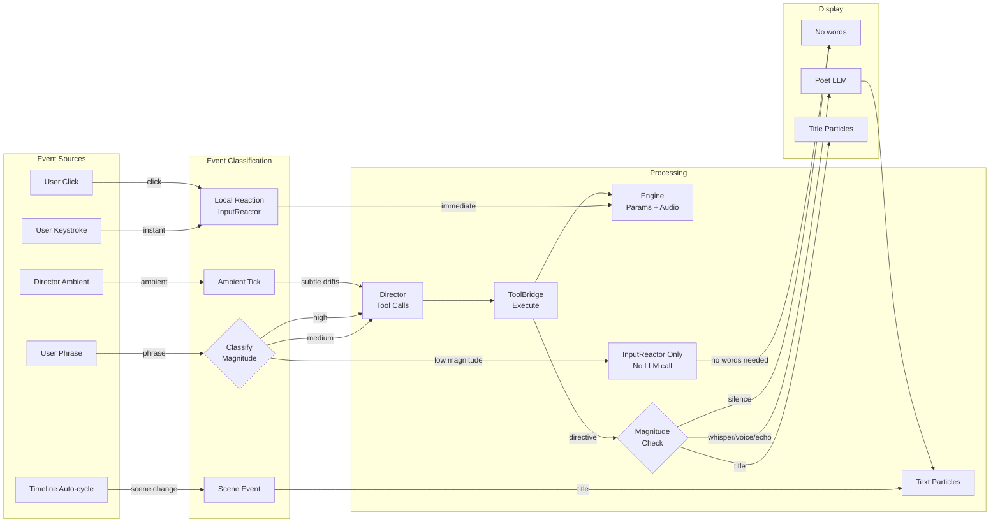
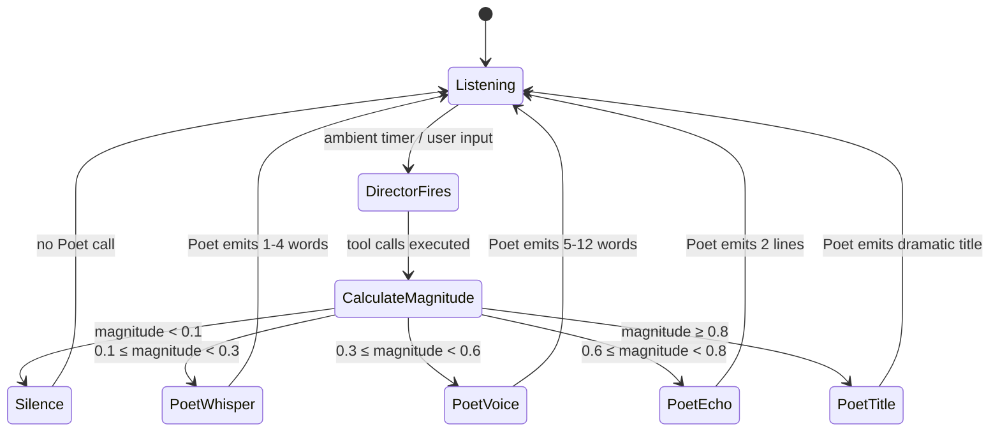
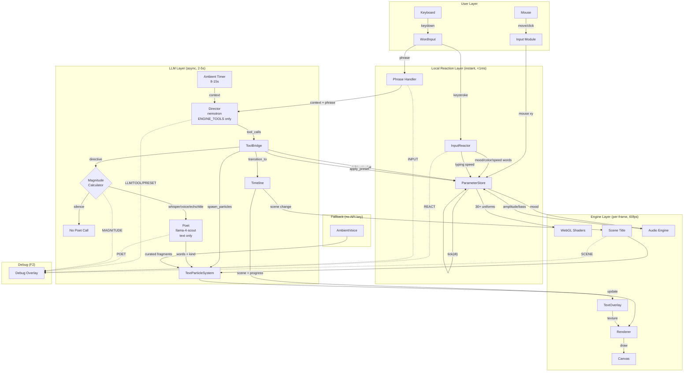

# ADR-008: Dual-LLM Event Architecture — Director, Poet, and the Infinite Portal

## Status
Proposed

## Context

OAV has evolved from a scripted trackmo into an **infinite, living portal**. The original single-LLM approach (Director does everything: tool calls + display text + thinking fragments) leaked technical content into the user's visual experience. We split into two LLMs, but the current wiring has gaps:

1. **The Director tells the Poet nothing about *how* to speak** — the Poet always picks its own kind (voice/echo/whisper/transform) based on simple heuristics
2. **Scene titles ("DEEP STRUCTURE") don't appear in the debug overlay** — they're a separate code path with no logging
3. **The Poet fires on every Director cycle** (8-15s) even when silence would be more powerful
4. **InputReactor and Director both react to user input** but don't coordinate — sometimes the local reaction and the LLM reaction fight each other
5. **No concept of "magnitude of change"** — a user typing "peace" and "DESTROY EVERYTHING" get the same response cadence

## Current Architecture

### Component Roles

| Component | Role | Runs |
|-----------|------|------|
| **InputReactor** | Instant local reactions to typed words (color, mood, speed) | Synchronous, per-keystroke/phrase |
| **Director** (nemotron) | Engine sculptor — tool calls only (drift_param, apply_preset, transition_to, etc.) | Async, every 8-15s or on user input |
| **ToolBridge** | Executes Director's tool calls against ParameterStore, Timeline, Particles | Synchronous, after Director responds |
| **Poet** (llama-4-scout) | Generates poetic display text — no tools, no engine control | Async, triggered after Director |
| **AmbientVoice** | Fallback when no API key — curated poetic fragments | Synchronous, timer-based |
| **TextParticleSystem** | Renders words as drifting, fading visual particles | Per-frame |
| **Timeline** | Infinite scene cycling (intro/build/climax, random order) | Per-frame auto-extend |
| **Audio** | 4-layer drone, mood-reactive, scene-reactive | Per-frame |

### Current Event Flow



### Current Gaps

```mermaid
graph TD
    subgraph "Gap 1: Director→Poet is one-way"
        D1[Director executes tools] -->|"mood context only"| P1[Poet picks kind blindly]
        P1 -->|"always voice/echo/whisper"| V1[Same visual weight every time]
    end

    subgraph "Gap 2: No magnitude awareness"
        U2[User types 'peace'] -->|"same cadence"| D2[Director responds]
        U3[User types 'DESTROY'] -->|"same cadence"| D2
    end

    subgraph "Gap 3: Scene titles untracked"
        T3[Timeline auto-cycles] -->|"showSceneTitle()"| V3[Title particles appear]
        V3 -.->|"NOT logged"| DBG[Debug Overlay]
    end

    subgraph "Gap 4: Poet always speaks"
        D4[Director fires] -->|"always triggers Poet"| P4[Poet always emits words]
        P4 -->|"clutters silence"| V4[Too many particles]
    end
```



## Decision

### 1. Director→Poet Directive

The Director should tell the Poet **how to speak**, not just provide mood context. After executing tool calls, we build a **directive** that the Poet receives:

```typescript
interface PoetDirective {
  /** How dramatic was the Director's action? 0=subtle, 1=total transformation */
  magnitude: number;
  /** Suggested display style */
  style: "silence" | "whisper" | "voice" | "echo" | "title";
  /** What just happened (for context) */
  actionSummary: string;
  /** User's emotional signal (if any) */
  userSignal: string | null;
}
```

**Magnitude calculation** from tool calls:
- Each `drift_param` contributes `|target - current| / range`
- `apply_preset` = 0.7 (big shift)
- `transition_to` = 1.0 (scene change)
- `shift_mood` = 0.5
- Sum capped at 1.0

**Style mapping from magnitude:**

| Magnitude | Style | Poet Behavior |
|-----------|-------|---------------|
| 0 - 0.1 | `silence` | Poet does NOT speak. The world breathes. |
| 0.1 - 0.3 | `whisper` | 1-4 words, faint, fast-fading |
| 0.3 - 0.6 | `voice` | 5-12 words, standard reveal |
| 0.6 - 0.8 | `echo` | Response to user feeling, 2 lines |
| 0.8 - 1.0 | `title` | Big dramatic word/phrase, scene-title styling |

This means:
- **Subtle ambient drifts** → silence or whisper (the world shifts without narration)
- **User types something** → echo (the world responds to their feeling)
- **Dramatic preset/scene change** → title (a word crashes into existence)
- **The Poet doesn't speak every cycle** — silence is a valid response

### 2. Unified Event Bus (Conceptual)

All significant events flow through a single classification:



### 3. Input Magnitude Classification

Not all user input deserves an LLM call. Short, common words can be handled locally:

| Input | Magnitude | Handler | Display |
|-------|-----------|---------|---------|
| Single keystroke | 0 | InputReactor | Keystroke particle only |
| 1-2 char word | 0.1 | InputReactor | Local reaction, no LLM |
| Known mood word ("peace", "fire") | 0.4 | InputReactor + Director | Local instant + LLM sculpts + Poet whispers |
| Unknown phrase | 0.5 | Director | LLM interprets + Poet responds |
| Long/emotional phrase | 0.7 | Director | LLM sculpts dramatically + Poet echoes |
| Matches preset name ("psychedelic") | 0.8 | InputReactor applies preset + Director | Instant preset + Poet titles |

### 4. Scene Titles as First-Class Events

Scene transitions should flow through the same event system and appear in the debug overlay:

```typescript
// In main.ts, when scene changes:
if (sceneId !== lastActiveSceneId) {
  lastActiveSceneId = sceneId;
  debug.log("SCENE", `→ ${sceneId}`);
  particles.showSceneTitle(sceneId, canvas.width, canvas.height);
}
```

### 5. Poet Cadence Control

The Poet should NOT speak on every Director cycle. The directive controls this:



### 6. Complete System Architecture



## What Changes

### Keep (working well)
- **InputReactor** — instant local reactions are essential for responsiveness
- **Director with ENGINE_TOOLS** — clean separation, tool_choice "required"
- **Poet as separate LLM** — eliminates thinking/tool leakage
- **ToolBridge** — solid execution layer
- **Debug overlay categories** — LLM, TOOL, PRESET, POET, REACT, INPUT
- **Infinite timeline** — random scene cycling, no outro in auto-schedule
- **Audio mood derivation** — params → energy/warmth/texture → drone layers

### Add
- **Magnitude calculator** — scores Director's tool calls to determine Poet style
- **PoetDirective** — Director→Poet communication includes style hint
- **Silence as valid Poet response** — magnitude < 0.1 means no words
- **SCENE debug tag** — scene transitions logged to overlay
- **MAGNITUDE debug tag** — shows calculated magnitude per Director cycle
- **Poet style in context** — Poet system prompt receives style directive

### Change
- **Poet.speak()** receives a `directive` with magnitude and style, not just mood context
- **Poet system prompt** adapts behavior based on directive style
- **Scene titles** logged to debug overlay

### Remove
- **Thinking fragment extraction** — no longer needed (Director doesn't generate display text)
- **Poet's internal `_pickKind`** — replaced by directive-driven style

## Implementation Priority

1. **Magnitude calculator + PoetDirective** — core improvement
2. **Scene title debug logging** — quick fix
3. **Poet cadence control** (silence when magnitude low)
4. **Poet style from directive** (whisper vs voice vs title)
5. **Remove thinking fragment extraction** (cleanup)

## Consequences

- **Pro**: The experience breathes — silence between words makes speech more powerful
- **Pro**: Dramatic input gets dramatic response; subtle input gets subtle response
- **Pro**: Debug overlay shows the full picture (SCENE, MAGNITUDE)
- **Pro**: Director and Poet are coordinated without being coupled
- **Pro**: Reduces API calls (Poet skipped when magnitude is low)
- **Con**: Magnitude calculation is heuristic — may need tuning
- **Con**: One more concept to understand (directive)
